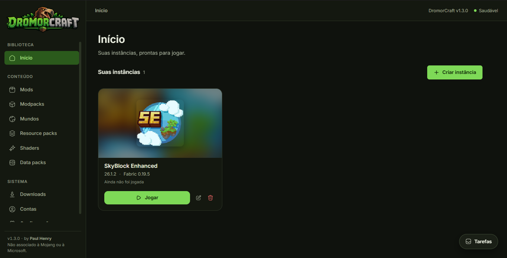
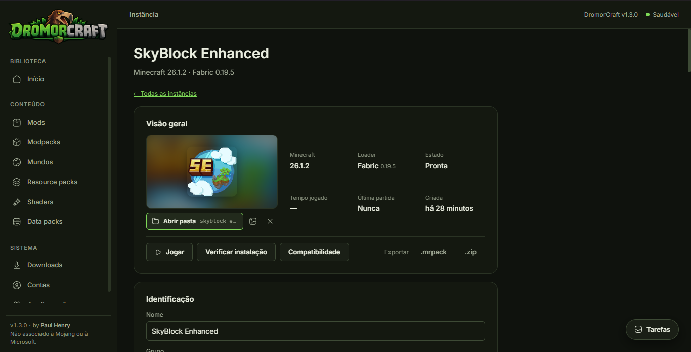
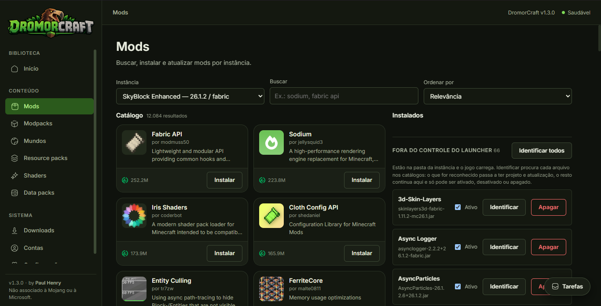
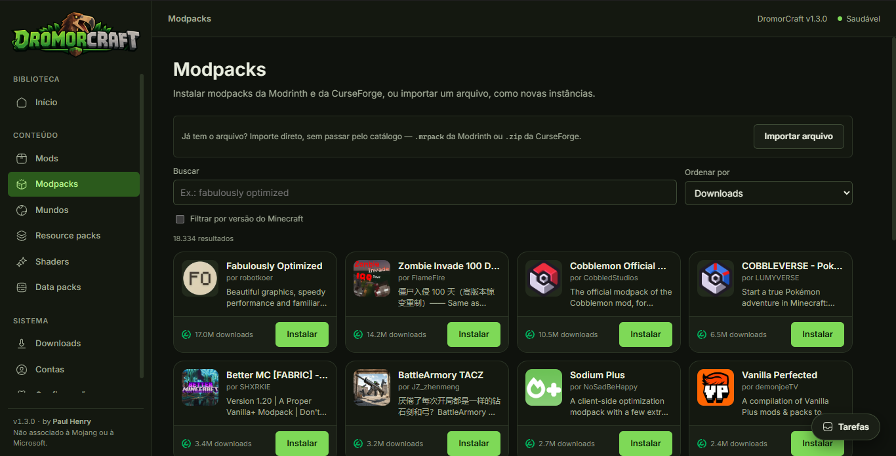
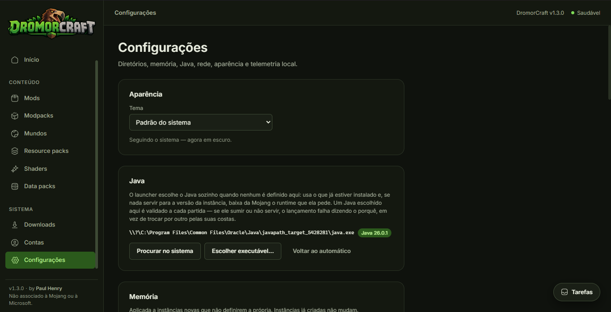

  

<h1 align="center">DromorCraft</h1>

  <strong>Um launcher de Minecraft feito em torno de instâncias.</strong> 
  Cada uma com sua versão, loader, mods, shaders e mundos, isolada das outras. 
  Leve, direto e feito para quem joga com mods.

  
  
  
  

  
  
  
  

  <a href="#️-download">Download</a> ·
  <a href="#-funcionalidades">Funcionalidades</a> ·
  <a href="#-provedores-e-loaders">Provedores</a> ·
  <a href="#-por-que-o-dromorcraft">Vantagens</a> ·
  <a href="#-atualizações-e-segurança">Segurança</a> ·
  <a href="#-comunidade">Comunidade</a> ·
  <a href="#‍-desenvolvedor">Desenvolvedor</a> ·
  <a href="#️-aviso-legal">Aviso legal</a>

  

---

> **Este repositório guarda os instaladores assinados e o feed de atualização do DromorCraft.**
> O código-fonte é mantido em um repositório separado; aqui moram apenas os artefatos de release,
> as notas de cada versão e o `latest.json` que o launcher instalado consulta para se atualizar.

## ⬇️ Download

Pegue a versão mais recente na página de releases:

  

| Plataforma | Arquivo | Como instalar |
|---|---|---|
| 🪟 **Windows 10 / 11** (x64) | `DromorCraft_<versão>_x64-setup.exe` | Execute o instalador. Precisa do [WebView2](https://developer.microsoft.com/microsoft-edge/webview2/) — já vem no Windows 11 e na maioria dos Windows 10 atualizados. |
| 🐧 **Linux** (x86_64) | `DromorCraft_<versão>_amd64.AppImage` | `chmod +x DromorCraft_*.AppImage && ./DromorCraft_*.AppImage`. Requer `webkit2gtk`. |

Cada arquivo vem acompanhado de um `.sig` — a assinatura que o launcher verifica antes de aplicar
qualquer atualização (veja [Atualizações e segurança](#-atualizações-e-segurança)).

**Não é preciso ter Java instalado.** Se a máquina não tiver o runtime que uma versão do Minecraft
pede, o launcher baixa o correto direto dos manifestos da Mojang.

## 📸 Telas

<table>
  <tr>
    <td width="50%"></td>
    <td width="50%"></td>
  </tr>
  <tr>
    <td align="center"><b>Instância</b> — visão geral, Abrir pasta, Jogar, Verificar instalação e exportação em .mrpack ou .zip</td>
    <td align="center"><b>Mods</b> — catálogo filtrado pela versão e loader da instância; arquivos soltos são identificados por hash</td>
  </tr>
  <tr>
    <td width="50%"></td>
    <td width="50%"></td>
  </tr>
  <tr>
    <td align="center"><b>Modpacks</b> — Modrinth e CurseForge, ou importe um <code>.mrpack</code>/<code>.zip</code> que você já tem</td>
    <td align="center"><b>Configurações</b> — tema, Java escolhido e validado a cada partida, memória padrão</td>
  </tr>
</table>

## ✨ Funcionalidades

### 🧱 Instâncias
- **Isolamento real** — cada instância tem sua própria pasta, versão do Minecraft, loader, mods, shaders, resource packs, configurações e mundos. Uma nunca interfere na outra.
- **Tela própria** — arte da instância, versão, loader, estado, tempo jogado, última partida, **Abrir pasta** e todas as ações num único painel, com o progresso de instalações e lançamentos sobre a arte.
- **Capas** — uma instância criada a partir de um modpack recebe o logo do pack; qualquer instância aceita uma imagem sua.
- **Memória inteligente** — o `-Xmx` padrão é calculado a partir da RAM da máquina (um quarto, entre 2 e 8 GB), e o launcher avisa quando um valor configurado não cabe.
- **Log de cada sessão** — inclusive das que o jogo nunca chegou a abrir.
- **Exportar** — qualquer instância vira um `.mrpack` (Modrinth) ou `.zip` (CurseForge) para compartilhar. O pacote *aponta* para os mods em vez de carregá-los, sem redistribuir o trabalho de ninguém, e diz na hora o que ficou de fora.

### 🎮 Minecraft e Java
- **Catálogo de versões ao vivo** — buscado do manifesto oficial da Mojang; nada de lista fixa que envelhece.
- **Instalação verificada** — jar do cliente, bibliotecas e assets, todos com hash conferido.
- **Java automático** — descobre os runtimes da máquina, interroga cada um (`java -XshowSettings`) em vez de adivinhar versão e arquitetura, e baixa da Mojang o runtime que faltar. Versões até a 1.12 ficam no Java 8, o único que o LaunchWrapper aceita.
- **Sessão resiliente** — fechar o launcher com o jogo aberto não perde a sessão; ao reabrir, ele reencontra o processo e o **Parar** volta a funcionar.

### 🔧 Loaders de mods
- **Fabric**, **Quilt**, **Forge** e **NeoForge** — builds listadas ao vivo e instaladas como overlay sobre a versão vanilla. Forge e NeoForge rodam os processadores dos próprios instaladores para produzir o jar patchado, com tudo verificado antes de executar.

### 📦 Mods, shaders, packs e modpacks
- **Catálogos integrados** — busca por instância na **Modrinth** e na **CurseForge**, com página própria de cada projeto (descrição, galeria, changelog) e instalação dali.
- **Dependências resolvidas** — instalar um mod traz as dependências obrigatórias, verifica cada arquivo e registra tudo.
- **Atualizações** — mods instalados podem ser checados e atualizados no lugar.
- **Todo tipo de conteúdo** — mods, resource packs, shader packs e data packs (estes vão para o mundo escolhido, que é de onde o jogo os lê). Packs e shaders funcionam inclusive em instâncias vanilla.
- **Modpacks** — instalam do catálogo da Modrinth ou da CurseForge, de um `.mrpack` ou de um `.zip` que você já tenha. O launcher lembra de qual pack e versão a instância veio.
- **Mods bloqueados pelo autor** — quando um pack da CurseForge traz um mod que o autor não permite que outros programas baixem, o launcher instala todo o resto e deixa um `MODS-QUE-FALTAM.txt` na pasta da instância dizendo quais faltam e onde pegar cada um.
- **O disco é a verdade** — a tela de conteúdo mostra o que a pasta realmente tem: um jar colocado à mão em `mods/` aparece com o nome que ele mesmo dá, um arquivo apagado por fora é marcado como sumido, e um mod ativado ou desativado no Explorer corrige o registro do launcher.
- **Arquivos soltos identificados** — o launcher calcula o hash de um jar anônimo e pergunta aos catálogos o que ele é (Modrinth por hash, CurseForge por fingerprint). Ele ganha projeto, versão e caminho de atualização.

### 🌍 Mundos
- **Leitura de `level.dat`** em três eras do formato — nome, versão, modo de jogo, miniatura.
- **Backup em `.zip`** e exclusão, direto do launcher.

### 👤 Contas
- **Microsoft** — login oficial pelo fluxo da Microsoft.
- **Perfis offline** — para jogar sem conta em servidores que permitem.
- Credenciais guardadas no cofre do sistema (keyring), nunca em arquivo, log ou URL.

### 🎨 Interface
- Identidade própria: logo, ícone e paleta derivada deles — verde-grama como cor de destaque.
- Tema **claro**, **escuro** ou **seguir o sistema**.
- Bandeja de tarefas com progresso e cancelamento; uma tarefa que falha avisa onde você estiver.
- Toda mensagem de erro diz **o que tentar em seguida**.
- Em português, do primeiro pixel ao último arquivo de log.

## 🔌 Provedores e loaders

| | Provedor | O que o DromorCraft usa |
|---|---|---|
| ⛏️ | **Mojang** | Manifesto de versões, cliente, bibliotecas, assets e runtimes Java — sempre dos servidores oficiais. |
|  | **Modrinth** | Mods, resource packs, shaders, data packs e modpacks (`.mrpack`); identificação de arquivos por hash. |
|  | **CurseForge** | Mods, packs, shaders e modpacks (`.zip`); identificação de arquivos por fingerprint. |
| 🪟 | **Microsoft** | Autenticação de contas Minecraft. |

| Loader | Suporte |
|---|---|
| Vanilla | ✅ |
| Fabric | ✅ |
| Quilt | ✅ |
| Forge | ✅ |
| NeoForge | ✅ |

Nenhuma lista de versões é fixa no launcher: tudo — Minecraft, loaders e conteúdo — vem dos manifestos e APIs públicas de cada provedor no momento em que você abre a tela.

## 🚀 Por que o DromorCraft?

| | |
|---|---|
| ⚡ **Leve de verdade** | Backend em **Rust**, interface em **Svelte** rodando sobre a WebView do sistema via **Tauri**. Sem Electron, sem Chromium embutido, sem uma JVM só para o launcher. |
| 🔒 **Tudo verificado** | Cada arquivo baixado tem o hash conferido contra o que o provedor declara. Instaladores e atualizações são assinados; o launcher recusa qualquer pacote sem assinatura válida. |
| 🔁 **Instalação idempotente** | Rodar de novo uma instalação nunca quebra o que já está lá — só completa o que falta. |
| 🧠 **Sem adivinhação** | Java, memória e conteúdo em disco são lidos do que realmente existe, não do que o launcher lembra. |
| 🌐 **Rede econômica** | Um único cliente HTTP com cache condicional: o que não mudou desde a última vez não é baixado de novo. |
| 🤝 **Respeita os autores** | Exportações apontam para os mods em vez de redistribuí-los, e mods com download restrito na CurseForge são deixados explicitamente para você buscar. |
| 🧾 **Falhas explicadas** | Cada erro vem com o próximo passo. Se o backend não subir, o motivo aparece na tela e em `nao-iniciou.txt`. |
| 🇧🇷 **Em português** | Interface, mensagens e notas de versão escritas para quem joga. |

## 🔄 Atualizações e segurança

- O launcher instalado consulta o [`latest.json`](https://github.com/PaulHenryDeveloper/DromorCraft-releases/releases/latest/download/latest.json) deste repositório e oferece a nova versão sozinho.
- **Toda atualização é assinada** com uma chave privada que existe apenas na máquina do mantenedor e no pipeline de build — nunca no repositório, nunca dentro do pacote. A chave pública correspondente está compilada no launcher, que rejeita qualquer artefato cuja assinatura não confira.
- Os releases são construídos por CI a partir de uma tag, com um *preflight* que recusa publicar uma versão sem notas ou sem chave de assinatura.
- Segredos (tokens de conta) ficam no cofre do sistema operacional — nunca no banco local, em logs, em URLs ou na interface.
- Nenhum comando de shell é executado a partir de entrada do usuário; caminhos de arquivo são validados e canonicalizados antes do uso.

## 🗂️ Onde ficam os dados

| Plataforma | Pasta |
|---|---|
| Windows | `%APPDATA%\DromorCraft` |
| Linux | `$XDG_DATA_HOME/dromorcraft` (normalmente `~/.local/share/dromorcraft`) |

Lá dentro: `instances/<nome>/`, `libraries/`, `assets/`, `java/`, `cache/`, `logs/`, `backups/` e o banco `dromorcraft.db`. A pasta pode ser trocada com a variável de ambiente `DROMORCRAFT_DATA_DIR`.

**Deu problema?** Se o launcher abrir numa tela de erro, ela diz por quê — e o mesmo texto está em `nao-iniciou.txt` na pasta de dados, que é onde olhar se a janela nem chegar a aparecer. Cada execução também deixa um arquivo em `logs/`. Leve esse arquivo ao [Discord](https://discord.gg/dromorcraft) ou abra uma [issue](https://github.com/PaulHenryDeveloper/DromorCraft-releases/issues).

## 💬 Comunidade

| Canal | Onde |
|---|---|
| 🌐 Site | [dromorcraft.com](https://dromorcraft.com) |
| 💜 Discord | [discord.gg/dromorcraft](https://discord.gg/dromorcraft) |
| ✈️ Telegram | [t.me/dromorcraft](https://t.me/dromorcraft) |
| 💚 WhatsApp | [dromorcraft.com/whatsapp](https://dromorcraft.com/whatsapp) |
| 🐛 Bugs e sugestões | [Issues deste repositório](https://github.com/PaulHenryDeveloper/DromorCraft-releases/issues) |

## 🛠️ Feito com

  
  
  
  
  
  

## 👨‍💻 Desenvolvedor

  <strong>Paul Henry</strong> — <a href="https://santus.me">santus.me</a> · <a href="https://github.com/PaulHenryDeveloper">@PaulHenryDeveloper</a>

Projetado, escrito e mantido de forma independente. Sugestões, relatos de bug e ideias são bem-vindos em qualquer um dos canais acima.

## ⚖️ Aviso legal

> **DromorCraft não é um produto oficial do Minecraft.** Não é aprovado, associado nem afiliado à
> Mojang Studios ou à Microsoft. **Minecraft** é marca registrada da Mojang Studios.
>
> Modrinth e CurseForge são marcas de seus respectivos titulares; o DromorCraft acessa seus
> catálogos por meio das APIs públicas de cada serviço e respeita as restrições de distribuição
> definidas pelos autores de cada conteúdo. Os mods, packs, shaders e modpacks instalados
> pertencem aos seus autores e são regidos pelas licenças que eles escolheram.
>
> O launcher precisa de uma cópia legítima do Minecraft: Java Edition para jogar online. Perfis
> offline existem para servidores que os permitem e não contornam nenhuma proteção do jogo.

**DromorCraft**, o nome e o logo são marcas de Paul Henry.
Os instaladores publicados aqui são distribuídos gratuitamente para uso pessoal; não os redistribua
modificados nem sob outro nome.

  © 2025–2026 Paul Henry. Todos os direitos reservados.

