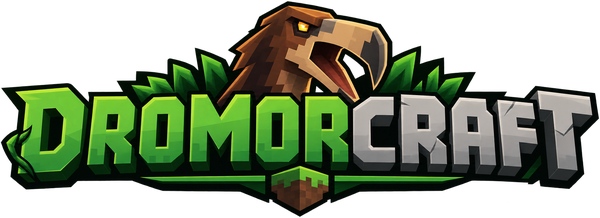
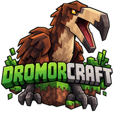

  

  <strong>Um launcher de Minecraft feito em torno de instâncias.</strong> 
  Cada uma com sua versão, loader, mods, shaders e mundos, isolada das outras. 
  Leve, direto e feito para quem joga com mods.

  
  
  
  

  
  
  
  

  <a href="#download">Download</a> ·
  <a href="#por-que-o-dromorcraft">Por que o DromorCraft</a> ·
  <a href="#recursos">Recursos</a> ·
  <a href="#provedores-e-loaders">Provedores</a> ·
  <a href="#atualizações">Atualizações</a> ·
  <a href="#comunidade">Comunidade</a> ·
  <a href="#desenvolvedor">Desenvolvedor</a> ·
  <a href="#aviso-legal">Aviso legal</a>

---

## Download

A versão mais recente está sempre na [página de releases](https://github.com/PaulHenryDeveloper/DromorCraft-releases/releases/latest).

| Plataforma | Arquivo | Como instalar |
|---|---|---|
| **Windows 10 / 11** (x64) | `DromorCraft_<versão>_x64-setup.exe` | Execute o instalador. Precisa do [WebView2](https://developer.microsoft.com/microsoft-edge/webview2/), que já vem no Windows 11 e na maioria dos Windows 10 atualizados. |
| **Linux** (x86_64) | `DromorCraft_<versão>_amd64.AppImage` | `chmod +x DromorCraft_*.AppImage && ./DromorCraft_*.AppImage`. Requer `webkit2gtk`. |

Cada arquivo vem acompanhado de um `.sig`: a assinatura que o launcher confere antes de
aplicar qualquer atualização.

**Não é preciso ter Java instalado.** Se a máquina não tiver o runtime que uma versão do
Minecraft pede, o launcher baixa o correto direto dos servidores da Mojang.

## Por que o DromorCraft

- **Leve de verdade** — abre rápido e ocupa pouca memória. Sem navegador embutido, sem
  uma máquina virtual só para o launcher: o que pesa é o jogo, não quem o abre.
- **Instâncias isoladas** — cada instância tem sua própria pasta, versão, loader, mods,
  shaders, packs, configurações e mundos. Uma nunca interfere na outra.
- **Tudo verificado** — cada arquivo baixado tem o hash conferido contra o que o
  provedor declara. Instaladores e atualizações são assinados, e o launcher recusa
  qualquer pacote cuja assinatura não confira.
- **Sem adivinhação** — Java, memória e o conteúdo em disco são lidos do que realmente
  existe na máquina, não do que o launcher lembra de ter instalado.
- **Instalação que não quebra** — repetir uma instalação nunca estraga o que já está lá,
  só completa o que falta.
- **Rede econômica** — o que não mudou desde a última vez não é baixado de novo.
- **Respeita os autores** — exportações apontam para os mods em vez de redistribuí-los, e
  mods com download restrito são deixados explicitamente para você buscar na fonte.
- **Falhas explicadas** — cada erro vem com o próximo passo a tentar. Se o launcher não
  abrir, o motivo aparece na tela e fica gravado num arquivo de texto.
- **Em português** — interface, mensagens, logs e notas de versão escritas para quem joga.

## Recursos

### Instâncias

- **Tela própria** — arte, versão, loader, estado, tempo jogado, última partida, abrir
  pasta e todas as ações num único painel, com o progresso de instalações e lançamentos
  sobre a arte.
- **Capas** — uma instância criada a partir de um modpack recebe o logo do pack; qualquer
  instância aceita uma imagem sua.
- **Memória inteligente** — o limite padrão é calculado a partir da RAM da máquina, e o
  launcher avisa quando um valor configurado não cabe.
- **Log de cada sessão** — inclusive das que o jogo nunca chegou a abrir.
- **Exportar** — qualquer instância vira um `.mrpack` (Modrinth) ou `.zip` (CurseForge)
  para compartilhar. O pacote aponta para os mods em vez de carregá-los, e diz na hora o
  que ficou de fora.

### Minecraft e Java

- **Catálogo de versões ao vivo** — buscado do manifesto oficial da Mojang; nada de lista
  fixa que envelhece.
- **Instalação verificada** — jar do cliente, bibliotecas e assets, todos com hash
  conferido.
- **Java automático** — descobre os runtimes da máquina, identifica versão e arquitetura
  de cada um e baixa da Mojang o que faltar. Versões antigas do jogo recebem o Java que
  elas realmente aceitam.
- **Sessão resiliente** — fechar o launcher com o jogo aberto não perde a sessão; ao
  reabrir, ele reencontra o processo e o botão Parar volta a funcionar.

### Loaders de mods

**Fabric, Quilt, Forge e NeoForge**, com builds listadas ao vivo e instaladas sobre a
versão vanilla. Forge e NeoForge são instalados pelo próprio launcher, com tudo
verificado antes de executar.

### Mods, shaders, packs e modpacks

- **Catálogos integrados** — busca por instância na Modrinth e na CurseForge, com página
  própria de cada projeto (descrição, galeria, changelog) e instalação dali.
- **Dependências resolvidas** — instalar um mod traz as dependências obrigatórias,
  verifica cada arquivo e registra tudo.
- **Atualizações** — mods instalados podem ser checados e atualizados no lugar.
- **Todo tipo de conteúdo** — mods, resource packs, shader packs e data packs (estes vão
  para o mundo escolhido, que é de onde o jogo os lê). Packs e shaders funcionam
  inclusive em instâncias vanilla.
- **Modpacks** — instalam do catálogo da Modrinth ou da CurseForge, de um `.mrpack` ou de
  um `.zip` que você já tenha. O launcher lembra de qual pack e versão a instância veio.
- **Mods bloqueados pelo autor** — quando um pack da CurseForge traz um mod que o autor
  não permite que outros programas baixem, o launcher instala todo o resto e deixa um
  `MODS-QUE-FALTAM.txt` na pasta da instância dizendo quais faltam e onde pegar cada um.
- **O disco é a verdade** — a tela de conteúdo mostra o que a pasta realmente tem: um jar
  colocado à mão em `mods/` aparece com o nome que ele mesmo dá, um arquivo apagado por
  fora é marcado como sumido, e um mod ativado ou desativado no Explorer corrige o registro
  do launcher.
- **Arquivos soltos identificados** — o launcher calcula o hash de um jar anônimo e
  pergunta aos catálogos o que ele é. Ele ganha projeto, versão e caminho de atualização.

### Mundos

- Leitura dos mundos salvos, das versões mais antigas do formato às atuais: nome, versão,
  modo de jogo e miniatura.
- Backup em `.zip` e exclusão, direto do launcher.

### Contas

- **Microsoft** — login oficial pelo fluxo da Microsoft.
- **Perfis offline** — para jogar sem conta em servidores que permitem.
- Credenciais guardadas no cofre do sistema operacional, nunca em arquivo, log ou URL.

### Interface

- Tema claro, escuro ou seguir o sistema.
- Bandeja de tarefas com progresso e cancelamento; uma tarefa que falha avisa onde você
  estiver.
- Toda mensagem de erro diz o que tentar em seguida.

## Provedores e loaders

| Provedor | O que o DromorCraft usa |
|---|---|
| **Mojang** | Manifesto de versões, cliente, bibliotecas, assets e runtimes Java, sempre dos servidores oficiais. |
| **Microsoft** | Autenticação de contas Minecraft. |
| **Modrinth** | Mods, resource packs, shaders, data packs e modpacks (`.mrpack`); identificação de arquivos por hash. |
| **CurseForge** | Mods, packs, shaders e modpacks (`.zip`); identificação de arquivos por fingerprint. |

Loaders suportados: **Vanilla, Fabric, Quilt, Forge e NeoForge.**

Nenhuma lista de versões é fixa no launcher: tudo — Minecraft, loaders e conteúdo — vem
dos manifestos e APIs públicas de cada provedor no momento em que você abre a tela.

## Atualizações

O launcher instalado verifica este repositório em **Configurações → Atualizações do
launcher** — nada é baixado sem você pedir — e instala a versão nova dali mesmo. Só
entra um pacote cuja assinatura confira com a chave pública que vem dentro do launcher;
qualquer outra coisa é recusada. Com o jogo aberto a atualização é recusada até você
fechar a sessão, para não derrubá-la no meio.

## Onde ficam os dados

| Plataforma | Pasta |
|---|---|
| Windows | `%APPDATA%\DromorCraft` |
| Linux | `~/.local/share/dromorcraft` |

Lá dentro ficam as instâncias, as bibliotecas e assets compartilhados, os runtimes Java,
os backups de mundos e os logs. Se o launcher abrir numa tela de erro, ela diz por quê,
e o mesmo texto está em `nao-iniciou.txt` nessa pasta — que é onde olhar se a janela nem
chegar a aparecer. Cada execução também deixa um arquivo em `logs/`; leve esse arquivo ao
[Discord](https://discord.gg/dromorcraft) ou abra uma
[issue](https://github.com/PaulHenryDeveloper/DromorCraft-releases/issues) e a resposta
chega mais rápido.

## Comunidade

| Canal | Onde |
|---|---|
| Site | [dromorcraft.com](https://dromorcraft.com) |
| Discord | [discord.gg/dromorcraft](https://discord.gg/dromorcraft) |
| Telegram | [t.me/dromorcraft](https://t.me/dromorcraft) |
| WhatsApp | [dromorcraft.com/whatsapp](https://dromorcraft.com/whatsapp) |
| Bugs e sugestões | [Issues deste repositório](https://github.com/PaulHenryDeveloper/DromorCraft-releases/issues) |

## Desenvolvedor

  
  <strong>Paul Henry</strong> 
  <a href="https://santus.me">santus.me</a> · <a href="https://github.com/PaulHenryDeveloper">@PaulHenryDeveloper</a> 
  Projetado, escrito e mantido de forma independente. Sugestões, relatos de bug e ideias são bem-vindos em qualquer um dos canais acima.

 

## Aviso legal

**DromorCraft não é um produto oficial do Minecraft.** Não é aprovado, associado nem
afiliado à Mojang Studios ou à Microsoft. Minecraft é marca registrada da Mojang Studios.
O launcher acessa apenas os serviços públicos da Mojang e da Microsoft, e o faz do mesmo
modo que o launcher oficial: os arquivos do jogo vêm dos servidores oficiais, e o login
passa pelo fluxo oficial da Microsoft.

O launcher precisa de uma cópia legítima do Minecraft: Java Edition para jogar online.
Perfis offline existem para servidores que os permitem e não contornam nenhuma proteção
do jogo.

Modrinth e CurseForge são marcas de seus respectivos titulares; o DromorCraft acessa seus
catálogos por meio das APIs públicas de cada serviço e respeita as restrições de
distribuição definidas pelos autores de cada conteúdo. Os mods, packs, shaders e modpacks
instalados pertencem aos seus autores e são regidos pelas licenças que eles escolheram.

DromorCraft, o nome e o logo são marcas de Paul Henry. Os instaladores publicados aqui são
distribuídos gratuitamente para uso pessoal; não os redistribua modificados nem sob outro
nome.

  © 2025–2026 Paul Henry. Todos os direitos reservados.

